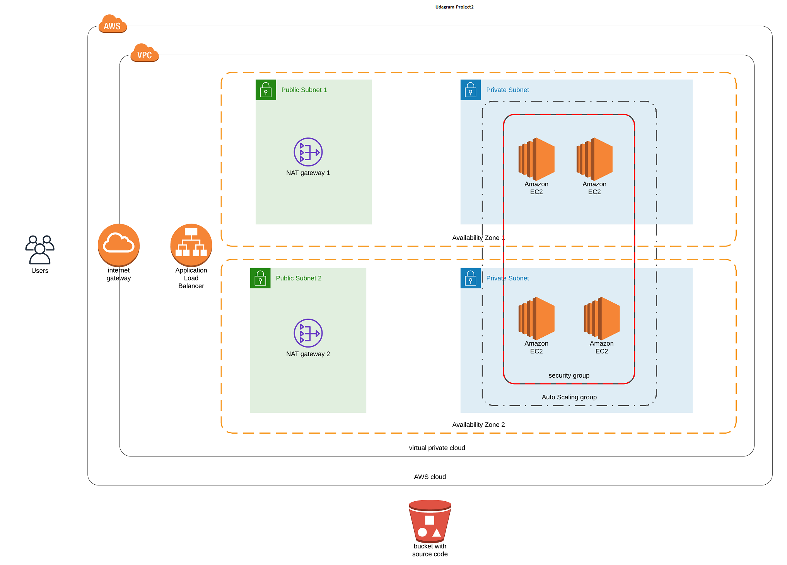

### udacity Cloud DevOps Engineer

#### Project 2 - Deploy Infrastructure as Code

This is an assignment for the [Udacity Devops Engineer Nanodegree] program.

The task is to deploy a high availability static website. The website should be hosted on servers within
private subnets. All traffic to the servers should be routed through NAT gateways located in public subnets.
For high availability there should not be any single point of failure and we should leverage auto scaling
as well as security best practices.When the stack has been created you can access the web application via the load balancer hostname.

To deploy this infrastructure and new stack you can run the create.sh followed by the stack name as below and takes `params.json`to deploy the stack-

like this: `./create.sh <STACKNAME> infra.yml params.json`

This is the infrastructure diagram for the cloudformation script deploys:

